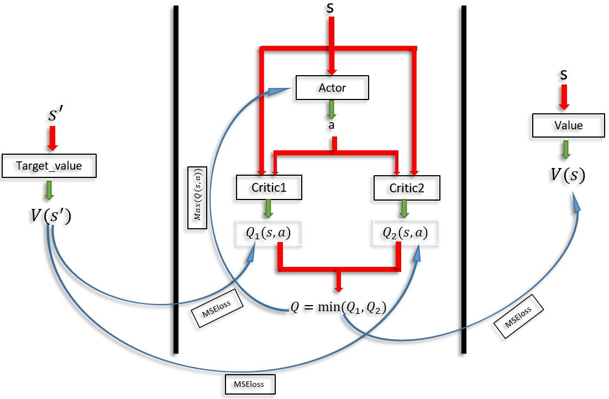

# Soft Actor Critic (SAC)
This folder contains the implementation of paper entitled "Soft Actor-Critic: Off-Policy Maximum Entropy Deep Reinforcement Learning with a Stochastic Actor" ("https://arxiv.org/pdf/1801.01290.pdf").

# The implementation pipeline:
The following figure displays the pipeline of the implementation of the SAC framework.

