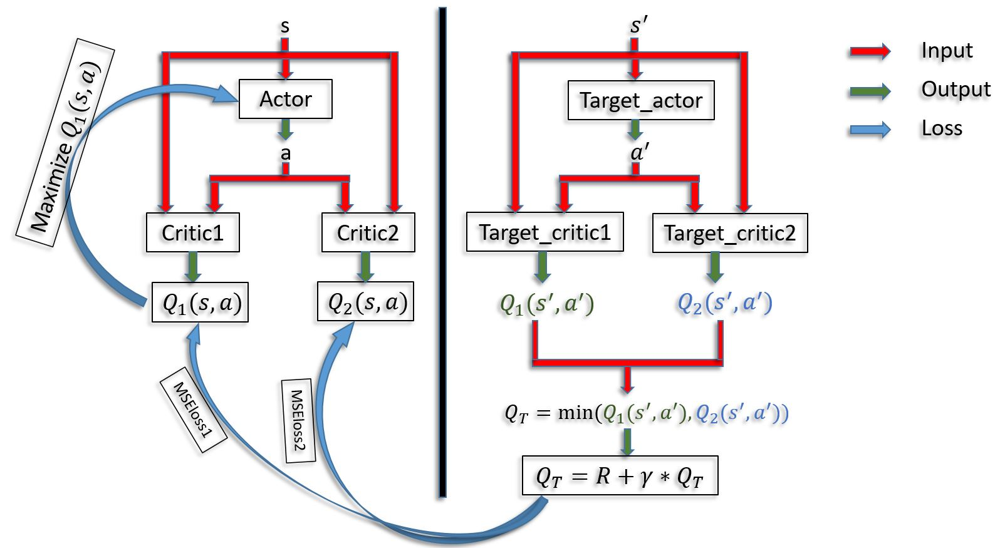

# Twin Delayed Deep Deterministic Policy Gradients (TD3)
This folder contains the implementation of paper entitled "Addressing Function Approximation Error in Actor-Critic Methods" ("https://arxiv.org/pdf/1802.09477.pdf").
This contribution of this paper is about minimizing the effects of overestimation on both the actor and the critic. This paper is based on the Double Q-learning. It takes the minimum between pair of critics to minimize the effect of overestimation. 

# Overestimation of a state is:
the highly estimation of the state value (too highly than what actually is)

# The implementation pipeline:
The following figure displays the pipeline of the implementation of the TD3 framework.

