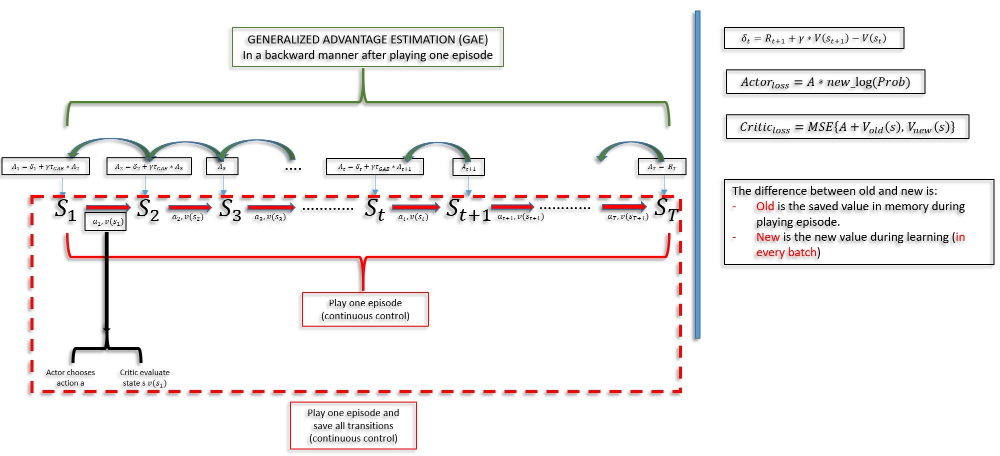

# GENERALIZED ADVANTAGE ESTIMATION (GAE)
This folder contains the implementation of paper entitled "HIGH-DIMENSIONAL CONTINUOUS CONTROL USING GENERALIZED ADVANTAGE ESTIMATION" ("https://arxiv.org/pdf/1506.02438.pdf").
This contribution of this paper is about using (GENERALIZED ADVANTAGE ESTIMATION (GAE)) in problems of HIGH-DIMENSIONAL CONTINUOUS CONTROL (problems that require continious control through all the episode).

# The implementation pipeline:
The following figure displays the pipeline of the implementation of the GAE framework.

